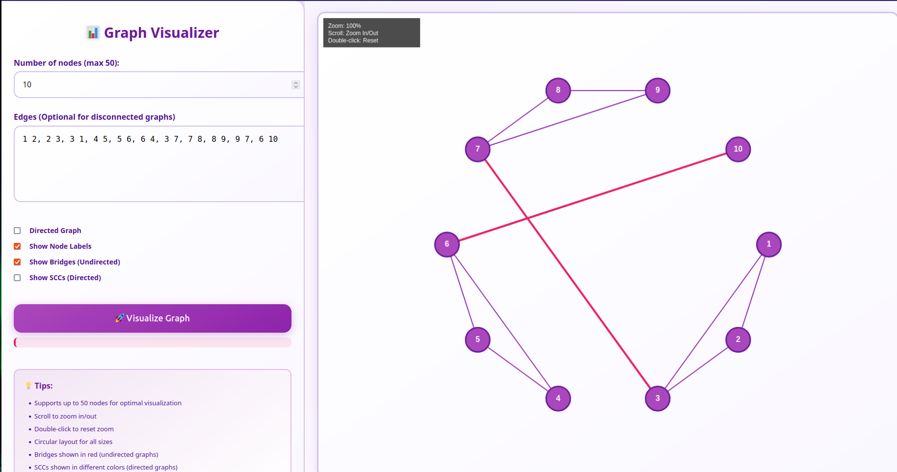
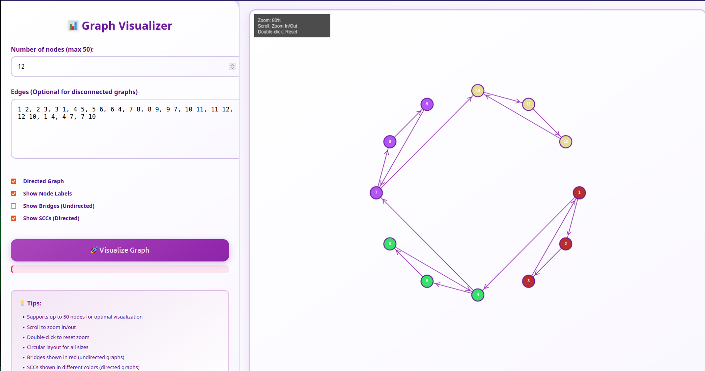

# 📊 Graph Visualizer

A powerful, interactive graph visualization tool with advanced algorithms for bridge detection and strongly connected components (SCCs).

## ✨ Features

- **Interactive Graph Creation**: Support for up to 50 nodes
- **Directed & Undirected Graphs**: Toggle between graph types with arrows
- **Bridge Detection** (Tarjan's Algorithm) - Highlights critical edges in red
- **Strongly Connected Components** (Kosaraju's Algorithm) - Color-coded visualization
- **Smart Edge Routing**: Curved edges to avoid node overlaps
- **Zoom Controls**: Mouse wheel zoom and double-click reset

## 🎯 Examples

### Bridge Detection (Undirected Graph)
Shows critical connections that would disconnect the graph if removed.



**Input:**
```
Nodes: 10
Edges: 1 2, 2 3, 3 1, 4 5, 5 6, 6 4, 3 7, 7 8, 8 9, 9 7, 6 10
Options: Show Bridges (Undirected)
```

### Strongly Connected Components (Directed Graph)
Identifies and colors groups of nodes that can reach each other.



**Input:**
```
Nodes: 12
Edges: 1 2, 2 3, 3 1, 4 5, 5 6, 6 4, 7 8, 8 9, 9 7, 10 11, 11 12, 12 10, 1 4, 4 7, 7 10
Options: Directed Graph, Show SCCs

